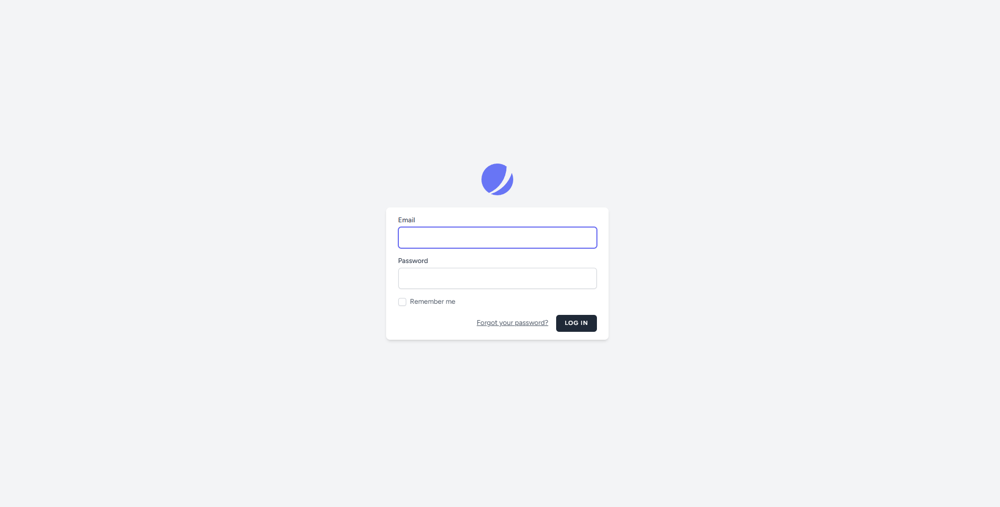
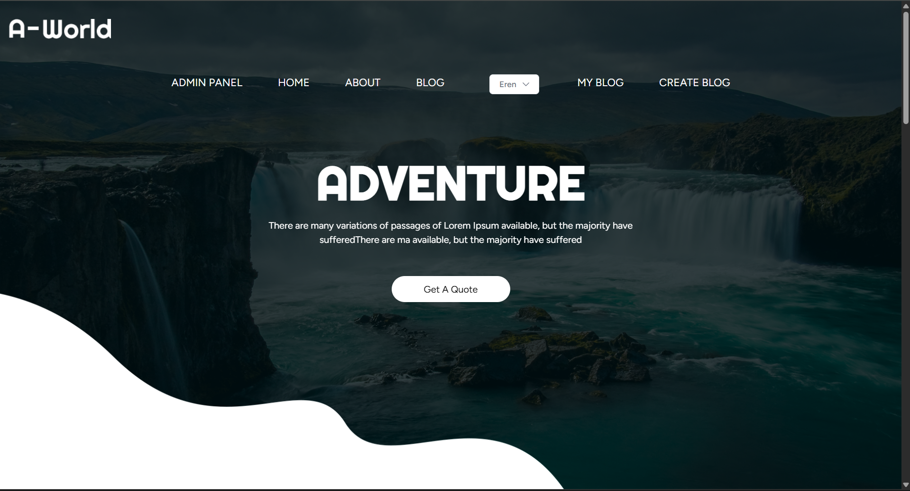
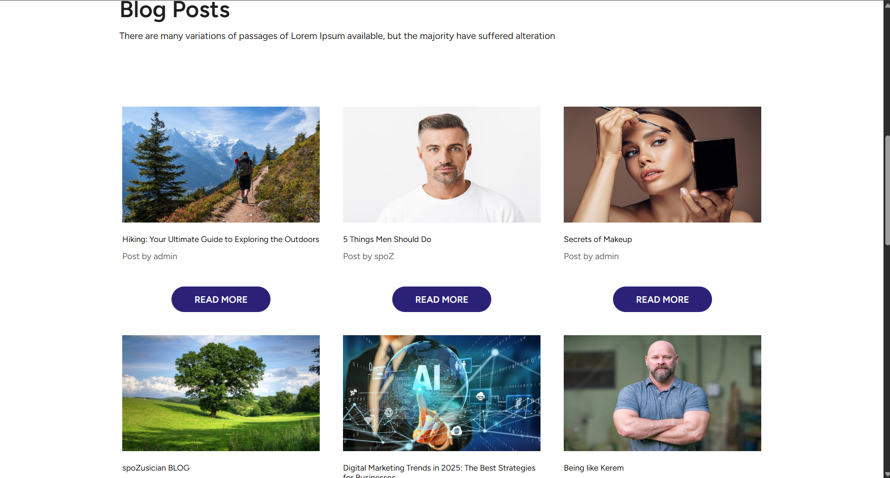
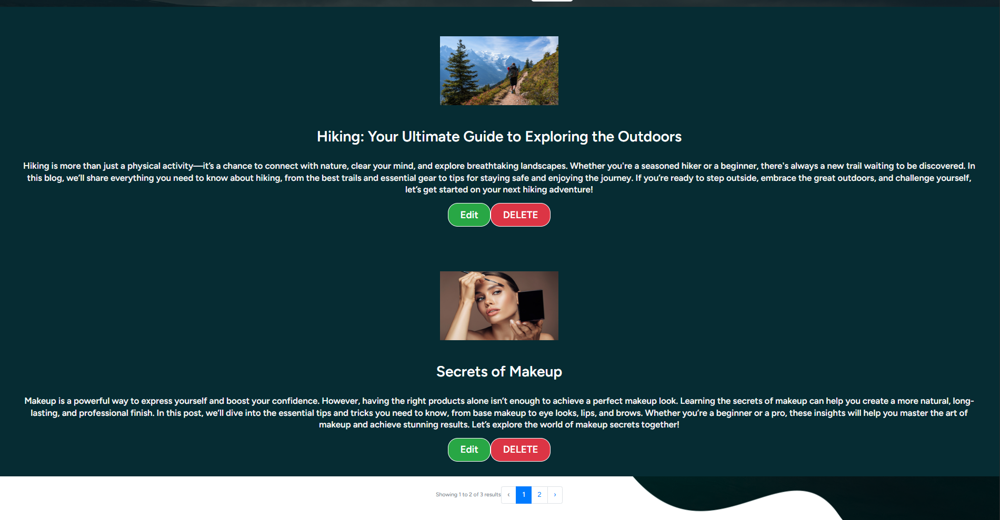
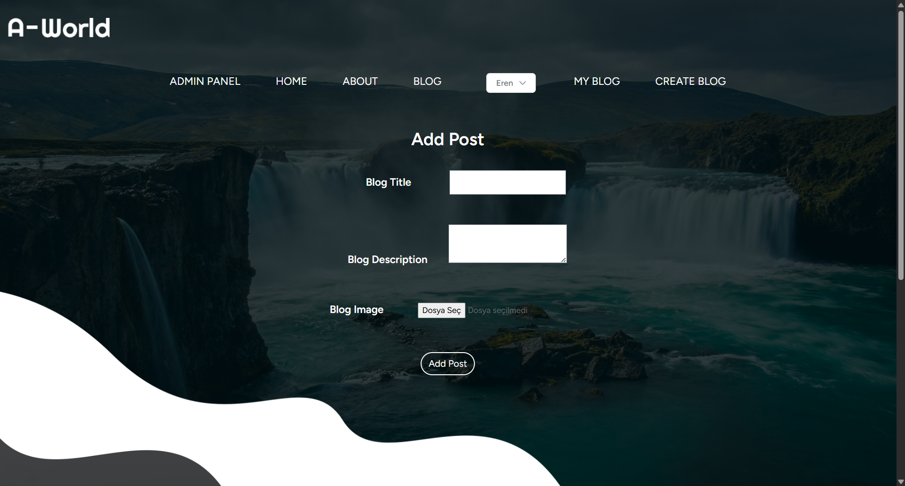
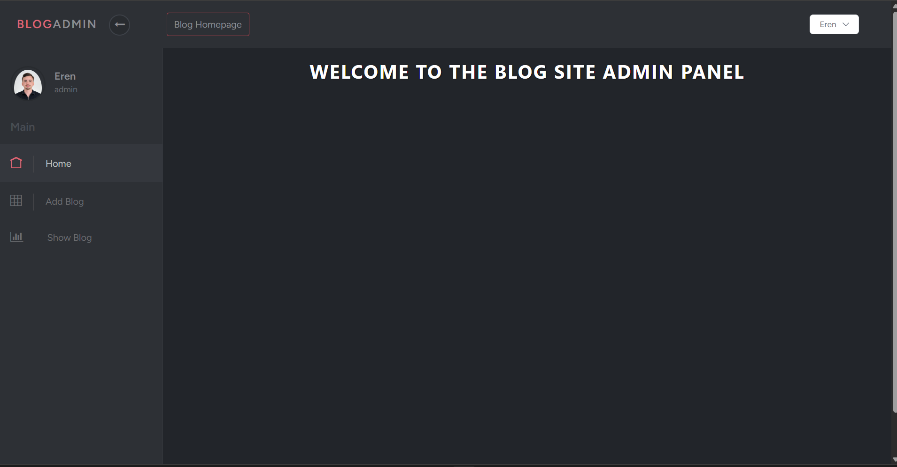
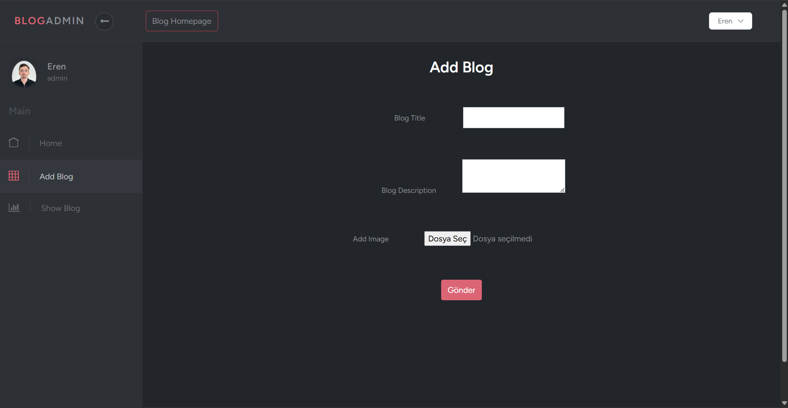
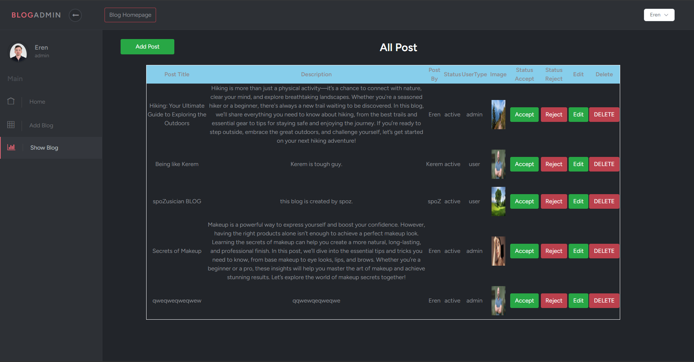

A Laravel-based blogging platform that allows users to create, edit, and manage their own blogs. Users can easily publish new posts and manage their content through a personalized "My Blog" section. An administrative panel provides comprehensive control, enabling admins to approve or reject posts before they appear publicly on the site. The project includes distinct frontend and backend interfaces, detailed blog listings, and robust user and content management features.

The platform uses Laravel Jetstream for secure authentication and user management, along with Spatie Laravel Permission for advanced role-based access control.

Main Features:

- User-authenticated blogging with CRUD operations
- Admin dashboard for managing and moderating all posts
- Approval system: Blog posts appear publicly only after admin approval
- Role-based access control using Spatie Laravel Permission
- Secure authentication and user management with Laravel Jetstream
- Responsive design using Laravel, PHP, Bootstrap, HTML, CSS, and JavaScript

**Note:**  
The frontend design (HTML, CSS, JavaScript) is based on a responsive template, customized and integrated into Laravel by me. Backend logic and admin panel are fully developed with Laravel and PHP.

<strong>Login:</strong>

<strong>Home:</strong>

<strong>Blog Posts:</strong>

<strong>My Blog:</strong>

<strong>Create Blog:</strong>

<strong>Admin Home:</strong>

<strong>Admin Add Post:</strong>

<strong>Admin Show Post:</strong>

Beni desteklemek için projeyi yıldızlarsanız çok sevinirim. Teşekkürler.

I would greatly appreciate it if you could star the project to support me. Thank you!.

